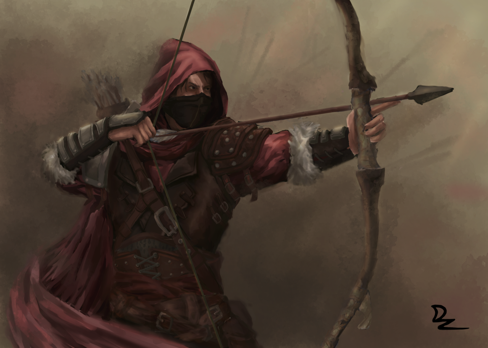

## The Warriors Game 

[Source of image](https://www.artstation.com/artwork/DxWNoG)

### Archers
 > After all fights between two most powerful armies,
 > small reinforcements units arrived.
 > 
> Among them, we see archers which stays at almost the end of the army, 
 > dealing enormous damage to an enemy. 
 > Maybe they can bring victory to the army?

**Archer** should be the subclass of the **Warrior** class and should have bow with which he can attack enemy units in 2,3, ... n position.
If there are more than one archer in the army, the first archer hits enemy on second position and the second archer hits enemy on third position and so on.

When he is in the front of the army he's changing his weapon and attack with his basic power.
He also has a finite amount of arrows to attack.

### The basic parameters of the Archer:
 - health: 30
 - attack: 2
 - arrowAttack: 4
 - amountOfArrows: 20

### Basic Examples:

