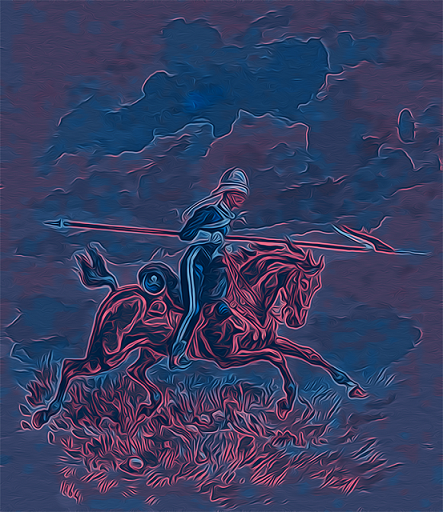

## The Warrior game

### Lancers
> It seems that the Warrior, Knight, Defender and Vampire are not enough to win the battle. Let's add one more powerful unit type - the Lancer.

Lancer should be the subclass of the Warrior class and should attack in a specific way - when he hits the other unit, he also deals a 50% of the deal damage to the enemy unit, standing behind the firstly assaulted one (enemy defense makes the deal damage value lower).

### The basic parameters of the Lancer:
 - health = 50
 - attack = 6
